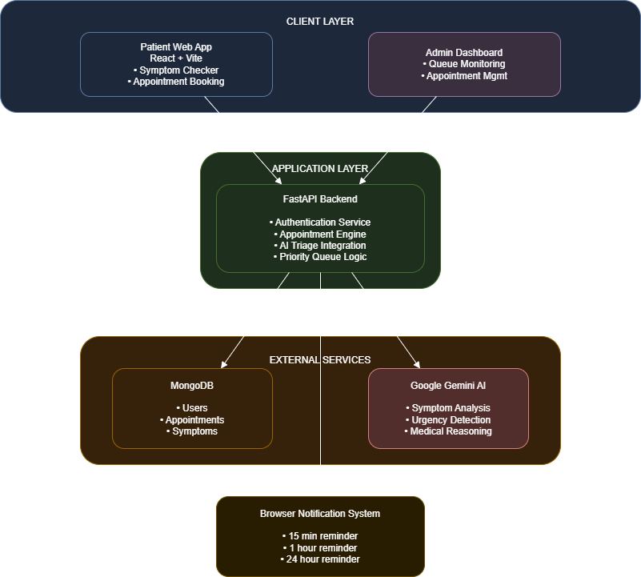
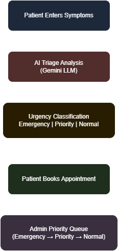

# MediStream AI — Intelligent Hospital Triage Platform

[]()
[]()
[]()
[]()

**MediStream AI** is a full-stack AI-powered hospital triage and
appointment management system designed to assist patients in identifying
the correct medical department and urgency level before booking an
appointment.

The platform integrates **Google Gemini (LLM)** for automated symptom
analysis, a **priority-based scheduling system**, and a **role-based
administrative dashboard** for managing patient queues.

This project demonstrates how AI can be integrated into healthcare
workflows to improve **patient routing, reduce hospital congestion, and
prioritize critical cases**.

------------------------------------------------------------------------

# Live Demo

Frontend\
https://med.praveenai.tech

Backend API\
https://medistream-ai-hospital-booking.onrender.com

------------------------------------------------------------------------

# Key Features

## AI-Powered Symptom Triage

Patients describe symptoms in natural language.

The system uses **Google Gemini LLM** to analyze the input and generate:

-   Suggested medical department
-   Urgency classification
-   Medical reasoning for the decision

Example:

``` json
{
  "suggestedDepartment": "Cardiology",
  "urgency": "Emergency",
  "reasoning": "Severe chest pain may indicate possible cardiac complications."
}
```

------------------------------------------------------------------------

## Dynamic Appointment Priority Queue

Appointments are automatically prioritized based on urgency
classification.

Priority order:

    Emergency > Priority > Normal

The **Admin Dashboard automatically sorts appointments**, ensuring
critical cases are handled first.

------------------------------------------------------------------------

## Role-Based Access Control

Two roles exist in the system.

### Patient

Patients can:

-   Perform AI symptom triage
-   Book appointments
-   View upcoming appointments
-   Cancel appointments
-   Reschedule appointments
-   View AI reasoning and triage summary

### Administrator

Admins can:

-   Monitor active patient queue
-   View all appointments
-   Track system usage
-   Manage hospital workflow

------------------------------------------------------------------------

## Secure Authentication

Authentication is implemented using **JWT tokens**.

Features:

-   Secure login
-   Token validation
-   Role-protected API endpoints
-   Admin-only dashboard routes

------------------------------------------------------------------------

## Appointment Management

Patients can:

-   Book appointments
-   Cancel sessions
-   Reschedule slots
-   View appointment history

Each appointment stores:

-   Department
-   Doctor
-   Urgency level
-   AI reasoning
-   Symptoms
-   Status

------------------------------------------------------------------------

## Notification Reminders

Patients can schedule reminders:

-   15 minutes before
-   1 hour before
-   24 hours before

Browser notifications are used for alerts.

------------------------------------------------------------------------

# System Architecture

<div style="text-align: center;">
    
</div>


## System Workflow

<div style="text-align: center;">
    
</div>


------------------------------------------------------------------------

# Technology Stack

## Frontend

-   React
-   TypeScript
-   TailwindCSS
-   Vite

## Backend

-   FastAPI
-   Python
-   JWT Authentication
-   REST API

## Database

-   MongoDB

## AI

-   Google Gemini API

## Deployment

Frontend: **Vercel**\
Backend: **Render**

------------------------------------------------------------------------

# API Endpoints

## Authentication

    POST /auth/login
    POST /auth/register
    GET /auth/me

## Appointments

    GET /appointments/my
    POST /appointments/book
    PUT /appointments/reschedule
    DELETE /appointments/cancel

## AI Triage

    POST /triage/analyze

## Admin

    GET /admin/users
    GET /admin/appointments

